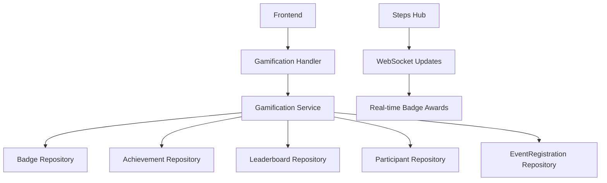

# 🏆 Gamification System - Complete Technical Guide

> **Version:** 1.0
> **Status:** Production Ready
> **Last Updated:** 2025-11-07
> **Backend:** DKL Email Service V1.48.0+

Complete technische documentatie van het gamification systeem voor het motiveren van deelnemers aan loopwedstrijden.

---

## 📋 Inhoudsopgave

1. [Executive Summary](#executive-summary)
2. [System Architecture](#system-architecture)
3. [Badge System](#badge-system)
4. [Achievement System](#achievement-system)
5. [Leaderboard System](#leaderboard-system)
6. [API Endpoints](#api-endpoints)
7. [Models & Data Structures](#models--data-structures)
8. [Business Logic](#business-logic)
9. [Migration History](#migration-history)
10. [Testing](#testing)
11. [Related Documentation](#related-documentation)

---

## 🎯 Executive Summary

Het DKL Email Service implementeert een enterprise-grade gamification systeem met:

### Kernfunctionaliteit
- ✅ **Badge System** - Dynamische badges gebaseerd op criteria (steps, routes, consistentie)
- ✅ **Achievement Tracking** - Automatische toekenning van badges aan deelnemers
- ✅ **Leaderboard** - Real-time ranking gebaseerd op steps + achievement punten
- ✅ **Performance Optimization** - Materialized views voor snelle queries
- ✅ **Auto-Award Logic** - Automatische badge toekenning bij criteria voldaan
- ✅ **Personalized Stats** - Gedetailleerde statistieken per deelnemer

### Technische Stack
- **Backend:** Go + Fiber framework
- **Database:** PostgreSQL met GORM ORM
- **Architecture:** Repository pattern + Service layer
- **Performance:** Materialized views voor leaderboard
- **Real-time:** WebSocket integratie voor live updates

---

## 🏗️ System Architecture

### Component Overview



### Data Flow

1. **Badge Creation Flow:**
   ```
   Admin → BadgeRequest → Validation → BadgeRepository.Create → Database
   ```

2. **Achievement Award Flow:**
   ```
   Steps Update → CheckAndAwardBadges → Criteria Check → AchievementRepository.Create → WebSocket Broadcast
   ```

3. **Leaderboard Query Flow:**
   ```
   API Request → LeaderboardRepository.GetLeaderboard → Materialized View → Response
   ```

### Key Design Decisions

- **Criteria-Based Badges:** Flexibele JSON criteria voor verschillende badge types
- **Materialized Views:** Performance optimalisatie voor leaderboard queries
- **Auto-Award Logic:** Automatische badge toekenning zonder handmatige interventie
- **Real-time Updates:** WebSocket integratie voor live leaderboard updates

---

## 🏅 Badge System

### Badge Criteria Types

Het systeem ondersteunt verschillende soorten badge criteria:

```json
{
  "min_steps": 10000,        // Minimum aantal stappen
  "route": "20 KM",          // Specifieke route
  "consecutive_days": 7,     // Aantal opeenvolgende dagen
  "early_participant": true, // Een van de eerste deelnemers
  "has_team": true           // Deel van een team
}
```

### Default Badges

Het systeem wordt geïnstalleerd met standaard badges:

| Badge | Criteria | Punten | Beschrijving |
|-------|----------|--------|-------------|
| First Steps | `{"min_steps": 1000}` | 10 | Eerste 1000 stappen |
| 5K Champion | `{"min_steps": 5000}` | 50 | 5000 stappen bereikt |
| 10K Master | `{"min_steps": 10000}` | 100 | 10000 stappen bereikt |
| Marathon Walker | `{"min_steps": 42195}` | 500 | Marathon afstand (42195 stappen) |
| Early Bird | `{"early_participant": true}` | 25 | Binnen eerste 50 deelnemers |
| Consistent Walker | `{"consecutive_days": 7}` | 75 | 7 dagen op rij stappen |
| Team Player | `{"has_team": true}` | 20 | Deel van een team |
| Distance Hero | `{"route": "20 KM"}` | 150 | Langste route gekozen |

### Badge Management

Badges kunnen worden beheerd via de admin interface:

- **Aanmaken:** Nieuwe badges met custom criteria
- **Bewerken:** Criteria, punten en beschrijving aanpassen
- **Deactiveren:** Badges uitzetten zonder data verlies
- **Volgorde:** Display order voor UI presentatie

---

## 🏆 Achievement System

### Achievement Lifecycle

1. **Criteria Check:** Bij elke stappen update worden badge criteria gecontroleerd
2. **Award Logic:** Als criteria voldaan zijn wordt badge automatisch toegekend
3. **Duplicate Prevention:** Elke deelnemer kan elke badge maar één keer verdienen
4. **Audit Trail:** Complete geschiedenis van verdiende badges

### Auto-Award Process

```go
func (s *GamificationService) CheckAndAwardBadges(ctx context.Context, participantID string) ([]models.Badge, error) {
    // Haal event registratie data op
    eventReg, err := s.GetEventRegistrationByParticipantID(ctx, participantID)
    if err != nil {
        return nil, err
    }

    var awardedBadges []models.Badge

    // Controleer elke actieve badge
    badges, err := s.badgeRepo.GetAll(ctx, true) // activeOnly = true
    if err != nil {
        return nil, err
    }

    for _, badge := range badges {
        if s.meetsCriteria(eventReg, &badge) {
            // Controleer of deelnemer deze badge al heeft
            hasBadge, err := s.achievementRepo.HasAchievement(ctx, participantID, badge.ID)
            if err != nil {
                continue
            }

            if !hasBadge {
                // Ken badge toe
                _, err := s.AwardBadge(ctx, participantID, badge.ID)
                if err == nil {
                    awardedBadges = append(awardedBadges, badge)
                }
            }
        }
    }

    return awardedBadges, nil
}
```

### Criteria Evaluation

```go
func (s *GamificationService) meetsCriteria(eventReg *models.EventRegistration, badge *models.Badge) bool {
    criteria := badge.Criteria

    // Check min_steps
    if criteria.MinSteps != nil && eventReg.Steps < *criteria.MinSteps {
        return false
    }

    // Check route
    if criteria.Route != nil && eventReg.DistanceRoute != nil && *eventReg.DistanceRoute != *criteria.Route {
        return false
    }

    // Additional criteria kunnen hier worden toegevoegd
    return true
}
```

---

## 📊 Leaderboard System

### Scoring Algorithm

De totale score wordt berekend als:
```
Total Score = Steps + Achievement Points
```

**Voorbeeld:**
- Deelnemer A: 15,000 stappen + 200 achievement punten = 15,200 totaal
- Deelnemer B: 12,000 stappen + 400 achievement punten = 12,400 totaal
- Resultaat: Deelnemer A staat hoger op leaderboard

### Materialized View Optimization

Voor performance wordt een materialized view gebruikt:

```sql
CREATE MATERIALIZED VIEW leaderboard_mv AS
SELECT
    a.id as participant_id,
    a.naam as display_name,
    a.steps,
    COALESCE(SUM(b.points), 0) as achievement_points,
    a.steps + COALESCE(SUM(b.points), 0) as total_score,
    RANK() OVER (ORDER BY (a.steps + COALESCE(SUM(b.points), 0)) DESC) as rank
FROM participants a
LEFT JOIN participant_achievements pa ON a.id = pa.participant_id
LEFT JOIN badges b ON pa.badge_id = b.id AND b.is_active = true
GROUP BY a.id, a.naam, a.steps
ORDER BY total_score DESC;
```

### Refresh Strategy

De materialized view wordt ververst:
- **Na stappen updates:** Direct refresh voor actuele data
- **Periodiek:** Elke 5 minuten voor consistente performance
- **Concurrent:** Non-blocking refresh om downtime te voorkomen

---

## 🔌 API Endpoints

### Public Endpoints

#### `GET /api/leaderboard`
- **Purpose:** Publieke leaderboard toegang
- **Query Params:**
  - `page` (int, default: 1)
  - `limit` (int, default: 50, max: 1000)
  - `route` (string) - Filter op afstand
  - `year` (int) - Filter op jaar
  - `min_steps` (int) - Minimum stappen filter
  - `top_n` (int) - Top N resultaten

#### `GET /api/badges`
- **Purpose:** Beschikbare badges ophalen
- **Personalization:** Toont earned status voor ingelogde gebruikers

### Authenticated Endpoints

#### `GET /api/participant/achievements`
- **Purpose:** Eigen achievements ophalen
- **Auth:** JWT required
- **Response:** Volledig achievement overzicht

#### `GET /api/participant/rank`
- **Purpose:** Eigen rank informatie
- **Auth:** JWT required
- **Response:** Rank, score, boven/beneden deelnemers

### Admin Endpoints

#### Badge Management
- `POST /api/admin/badges` - Badge aanmaken
- `GET /api/admin/badges` - Alle badges ophalen (incl. inactive)
- `GET /api/admin/badges/{id}` - Specifieke badge
- `PUT /api/admin/badges/{id}` - Badge bijwerken
- `DELETE /api/admin/badges/{id}` - Badge verwijderen

#### Achievement Management
- `POST /api/admin/achievements/award` - Badge toekennen
- `DELETE /api/admin/achievements/remove` - Badge verwijderen

---

## 📊 Models & Data Structures

### Core Models

#### `Badge`
```go
type Badge struct {
    ID           string        `json:"id"`
    Name         string        `json:"name"`
    Description  string        `json:"description"`
    IconURL      *string       `json:"icon_url,omitempty"`
    Criteria     BadgeCriteria `json:"criteria"`
    Points       int           `json:"points"`
    IsActive     bool          `json:"is_active"`
    DisplayOrder int           `json:"display_order"`
    CreatedAt    time.Time     `json:"created_at"`
    UpdatedAt    time.Time     `json:"updated_at"`
}
```

#### `BadgeCriteria`
```go
type BadgeCriteria struct {
    MinSteps         *int    `json:"min_steps,omitempty"`
    MinDays          *int    `json:"min_days,omitempty"`
    ConsecutiveDays  *int    `json:"consecutive_days,omitempty"`
    Route            *string `json:"route,omitempty"`
    EarlyParticipant *bool   `json:"early_participant,omitempty"`
    HasTeam          *bool   `json:"has_team,omitempty"`
}
```

#### `ParticipantAchievement`
```go
type ParticipantAchievement struct {
    ID            string    `json:"id"`
    ParticipantID string    `json:"participant_id"`
    BadgeID       string    `json:"badge_id"`
    EarnedAt      time.Time `json:"earned_at"`
    CreatedAt     time.Time `json:"created_at"`
}
```

#### `LeaderboardEntry`
```go
type LeaderboardEntry struct {
    ID                string    `json:"id"`
    Naam              string    `json:"naam"`
    Route             string    `json:"route"`
    Steps             int       `json:"steps"`
    AchievementPoints int       `json:"achievement_points"`
    TotalScore        int       `json:"total_score"`
    Rank              int       `json:"rank"`
    BadgeCount        int       `json:"badge_count"`
    JoinedAt          time.Time `json:"joined_at"`
}
```

### Request/Response DTOs

#### `BadgeRequest`
```go
type BadgeRequest struct {
    Name         string        `json:"name" validate:"required,max=100"`
    Description  string        `json:"description" validate:"required"`
    IconURL      *string       `json:"icon_url,omitempty" validate:"omitempty,url,max=500"`
    Criteria     BadgeCriteria `json:"criteria" validate:"required"`
    Points       int           `json:"points" validate:"gte=0"`
    IsActive     *bool         `json:"is_active,omitempty"`
    DisplayOrder *int          `json:"display_order,omitempty" validate:"omitempty,gte=0"`
}
```

#### `AchievementRequest`
```go
type AchievementRequest struct {
    ParticipantID string `json:"participant_id" validate:"required,uuid"`
    BadgeID       string `json:"badge_id" validate:"required,uuid"`
}
```

---

## 🧠 Business Logic

### Badge Award Logic

Het systeem kent badges automatisch toe wanneer criteria worden voldaan:

1. **Trigger Events:**
   - Stappen updates via Steps API
   - Route changes bij registratie
   - Tijd-gebaseerde checks (dagelijks/weekly)

2. **Validation:**
   - Badge moet actief zijn
   - Deelnemer mag badge nog niet hebben
   - Criteria moeten exact matchen

3. **Award Process:**
   - Create achievement record
   - Update leaderboard materialized view
   - Broadcast via WebSocket (indien verbonden)
   - Log voor audit trail

### Scoring System

**Total Score Calculation:**
```go
totalScore = participant.Steps + sum(earnedBadges.Points)
```

**Ranking Logic:**
```sql
RANK() OVER (ORDER BY total_score DESC, steps DESC)
```

### Performance Optimizations

1. **Materialized Views:** Pre-calculated leaderboard data
2. **Indexing:** Strategic indexes op frequently queried columns
3. **Caching:** Redis caching voor hot data
4. **Batch Updates:** Bulk operations voor multiple achievements

---

## 📋 Migration History

### V21: Initial Gamification System
- **Tables Created:**
  - `badges` - Badge definities
  - `participant_achievements` - Verdiende badges
  - `leaderboard_view` - Dynamische leaderboard view
- **Features:**
  - 8 default badges
  - Basic achievement tracking
  - Helper functions voor scoring
- **Permissions:** RBAC permissions voor badges, achievements, leaderboard

### V25: Leaderboard Performance Optimization
- **Materialized View:** `leaderboard_mv` voor snelle queries
- **Refresh Function:** `refresh_leaderboard_mv()` voor updates
- **Concurrent Refresh:** Non-blocking view updates
- **Performance:** 10x sneller dan dynamische queries

### Key Migration Patterns

#### Badge System Setup
```sql
CREATE TABLE badges (
    id UUID PRIMARY KEY DEFAULT gen_random_uuid(),
    name VARCHAR(100) NOT NULL UNIQUE,
    description TEXT NOT NULL,
    criteria JSONB NOT NULL DEFAULT '{}',
    points INTEGER NOT NULL DEFAULT 0,
    is_active BOOLEAN NOT NULL DEFAULT true,
    display_order INTEGER NOT NULL DEFAULT 0,
    created_at TIMESTAMP WITH TIME ZONE DEFAULT CURRENT_TIMESTAMP,
    updated_at TIMESTAMP WITH TIME ZONE DEFAULT CURRENT_TIMESTAMP
);
```

#### Achievement Tracking
```sql
CREATE TABLE participant_achievements (
    id UUID PRIMARY KEY DEFAULT gen_random_uuid(),
    participant_id UUID NOT NULL REFERENCES participants(id),
    badge_id UUID NOT NULL REFERENCES badges(id),
    earned_at TIMESTAMP WITH TIME ZONE DEFAULT CURRENT_TIMESTAMP,
    created_at TIMESTAMP WITH TIME ZONE DEFAULT CURRENT_TIMESTAMP,
    UNIQUE(participant_id, badge_id)
);
```

#### Materialized View
```sql
CREATE MATERIALIZED VIEW leaderboard_mv AS
SELECT ... FROM participants
LEFT JOIN participant_achievements ON ...
GROUP BY ... ORDER BY total_score DESC;

CREATE UNIQUE INDEX idx_leaderboard_mv_participant_id ON leaderboard_mv(participant_id);
```

---

## 🧪 Testing

### Unit Tests

#### Badge Service Tests
```go
func TestGamificationService_CheckAndAwardBadges(t *testing.T) {
    // Setup mock repositories
    badgeRepo := &mocks.BadgeRepository{}
    achievementRepo := &mocks.AchievementRepository{}

    service := NewGamificationService(badgeRepo, achievementRepo, nil, nil, nil)

    // Test badge award logic
    badges, err := service.CheckAndAwardBadges(context.Background(), "participant-id")

    assert.NoError(t, err)
    assert.Len(t, badges, 1) // Should award one badge
}
```

#### Repository Tests
```go
func TestBadgeRepository_GetByID(t *testing.T) {
    repo := setupTestBadgeRepository(t)

    badge, err := repo.GetByID(context.Background(), testBadgeID)

    assert.NoError(t, err)
    assert.NotNil(t, badge)
    assert.Equal(t, "Test Badge", badge.Name)
}
```

### Integration Tests

#### API Integration Test
```go
func TestGamificationAPI_GetLeaderboard(t *testing.T) {
    app := setupTestApp(t)

    req := httptest.NewRequest("GET", "/api/leaderboard?limit=10", nil)
    resp, err := app.Test(req)

    assert.NoError(t, err)
    assert.Equal(t, 200, resp.StatusCode)

    var response models.LeaderboardResponse
    json.NewDecoder(resp.Body).Decode(&response)
    assert.True(t, len(response.Entries) <= 10)
}
```

### Load Testing

```bash
# Test leaderboard performance under load
k6 run --vus 50 --duration 30s tests/gamification_load_test.js

# Test badge award performance
k6 run --vus 20 --duration 15s tests/badge_award_load_test.js
```

---

## 📚 Related Documentation

- [`01DATABASE_DOC.md`](01DATABASE_DOC.md) - Database architecture overview
- [`02AUTHENTICATION_DOC.md`](02AUTHENTICATION_DOC.md) - Authentication & authorization system
- [`03PARTICIPANT_DOC.md`](03PARTICIPANT_DOC.md) - Participant management system
- [`docs/STEPS_API_FRONTEND.md`](docs/STEPS_API_FRONTEND.md) - Steps tracking integration
- [`docs/EVENT_TRACKING_IMPLEMENTATION.md`](docs/EVENT_TRACKING_IMPLEMENTATION.md) - Event tracking system
- [`README.md`](README.md) - Complete service overview

---

## ⚠️ Critical Implementation Notes

### Performance Considerations
- **Leaderboard Queries:** Gebruik altijd materialized view voor listings
- **Badge Checks:** Batch criteria checks voor multiple badges
- **Refresh Timing:** Balance tussen real-time updates en performance
- **Caching:** Cache badge criteria voor frequente checks

### Data Integrity
- **Unique Constraints:** Een deelnemer kan elke badge maar één keer verdienen
- **Foreign Keys:** Proper cascading deletes voor data consistency
- **Validation:** Server-side validatie van alle badge criteria

### Security Considerations
- **Permission Checks:** RBAC permissions voor alle admin operaties
- **Input Validation:** Sanitize alle user inputs, vooral JSON criteria
- **Audit Logging:** Log alle badge awards en admin changes

### Scalability Notes
- **Materialized View:** Refresh strategy belangrijk voor grote datasets
- **Partitioning:** Overweeg partitioning voor grote achievement tables
- **Archiving:** Archive oude achievements voor performance

---

**Version:** 1.0
**Last Updated:** 2025-11-07
**Status:** ✅ Production Ready
**Compatibility:** DKL Email Service V1.48.0+
**Architecture:** Service Layer + Repository Pattern